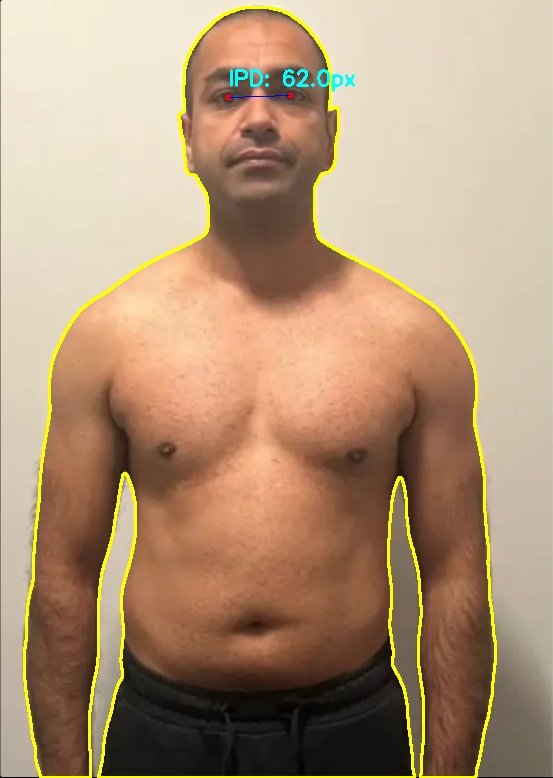
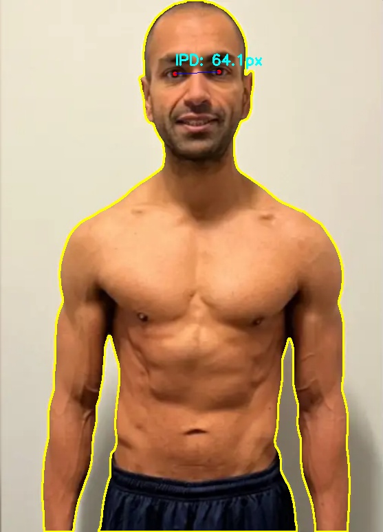

# 🏋️‍♂️ BodyProgress Tracker

**BodyProgress Tracker**, spor yapan bireylerin vücut gelişimlerini profesyonel bir şekilde takip etmeleri için tasarlanmış, **Yapay Zeka** destekli bir görsel analiz aracıdır.

### 📸 Ekran Görüntüleri

| Analiz Edilmiş Görüntü 1 | Analiz Edilmiş Görüntü 2 |
|--------------------------|--------------------------|
|  |  |

*(Bu görseller sistem tarafından üretilmiş gerçek çıktı örnekleridir)*

---

## 🌟 Özellikler

### 🎯 Akıllı Hizalama (Smart Alignment)
Yüklenen **"Öncesi" (Before)** ve **"Sonrası" (After)** fotoğraflarını; omuz, yüz ve vücut referans noktalarını kullanarak otomatik olarak hizalar ve ölçeklendirir.

### 📐 Detaylı Veri Analizi
Gelişmiş görüntü işleme algoritmaları ile detaylı ölçümler sunar:
*   **👁️ Göz Bebeği Mesafesi (IPD):** Milimetrik hassasiyetle iris merkezlerini tespit eder.
*   **🧍 Vücut Silüeti:** `rembg` teknolojisi kullanarak vücudun dış hatlarını (contour) kusursuz bir şekilde çıkarır ve görselleştirir.

### 📊 Görsel karşılaştırma
*   **Slider Arayüzü:** Değişimi net görmek için etkileşimli karşılaştırma çubuğu.
*   **Overlay Modu:** İki fotoğrafı şeffaflık ayarı ile üst üste bindirme.

---

## 🛠️ Teknolojiler

Modern ve güçlü bir teknoloji yığını üzerine inşa edilmiştir:

| Alan | Teknoloji | Açıklama |
|------|-----------|----------|
| **Frontend** |   | Hızlı, reaktif ve şık arayüz. |
| **Backend** |   | Yüksek performanslı API sunucusu. |
| **AI / CV** |   | Pose Estimation, Face Mesh ve Görüntü İşleme. |
| **ML Models** | **Rembg (U2Netp)** | Arka plan temizleme ve silüet çıkarma. |

---

## 🚀 Kurulum ve Çalıştırma

### Ön Gereksinimler
*   Node.js (v18+)
*   Python (v3.10+)

### ⚡ Hızlı Başlangıç (Otomatik)

Projenin kök dizinindeki başlatma betiğini kullanın. Bu betik hem backend'i hem frontend'i tek seferde başlatır.

**Windows (PowerShell):**
```powershell
./start_project.ps1
```

---

### 🔧 Manuel Kurulum

Eğer sunucuları ayrı ayrı başlatmak isterseniz:

#### 1. Backend Kurulumu
```bash
cd backend

# Gerekli kütüphaneleri yükleyin
pip install -r requirements.txt
pip install rembg onnxruntime mediapipe numpy

# Sunucuyu başlatın (Port: 8000)
python -m uvicorn main:app --reload
```

#### 2. Frontend Kurulumu
```bash
cd frontend

# Paketleri yükleyin
npm install

# Geliştirme sunucusunu başlatın (Port: 3000)
npm run dev
```

---

## 🎮 Kullanım

1.  Web tarayıcınızda `http://localhost:3000` adresine gidin.
2.  **Karşılaştırma Modu:**
    *   Sol tarafa eski, sağ tarafa yeni fotoğrafınızı yükleyin.
    *   **"Fotoğrafları Hizala"** butonuna basın.
    *   Slider ile değişimi gözlemleyin.
3.  **Analiz Modu (Yeni):**
    *   Sayfanın altındaki **"Veri Analizi"** bölümüne gidin.
    *   Tek bir fotoğraf yükleyin ve **"Analiz Et"** deyin.
    *   Sistemin göz bebeklerinizi ve vücut hatlarınızı nasıl tespit ettiğini inceleyin.

---

## 👥 Katkıda Bulunma
Pull request'ler kabul edilir. Büyük değişiklikler için önce bir issue açarak tartışalım.

## 📄 Lisans
[MIT](https://choosealicense.com/licenses/mit/)